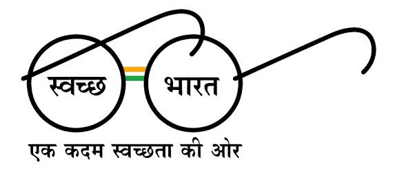
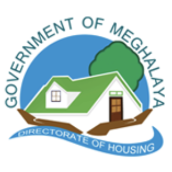

# MegHousing Portal

## Directorate of Housing, Government of Meghalaya


> **Modernizing Public Services: A Responsive, Accessible, and Compliant Government Portal**

---

## 📌 Overview

The **MegHousing Portal** is a comprehensive digital solution designed to streamline housing-related services and information for the citizens of Meghalaya. This portal represents a significant step towards digital transformation in government service delivery, combining modern web standards with rigorous compliance frameworks.

Built with accessibility and inclusion at its core, the portal ensures equitable access to housing services for all citizens, irrespective of their technical proficiency or physical abilities.

---

## ✨ Key Features

### 🎯 Citizen-Centric Design

- **Intuitive Navigation**: Simplified hierarchy for easy access to housing schemes, applications, and services
- **Clear Information Architecture**: Organized content aligned with citizen needs and government objectives
- **Mobile-First Approach**: Seamless experience across devices—desktop, tablet, and mobile

### 🔒 Accessibility & Inclusivity

- **WCAG 2.1 AA Compliant**: Full compliance with Web Content Accessibility Guidelines
- **Screen Reader Support**: Optimized for assistive technologies
- **Keyboard Navigation**: Complete functionality without mouse dependency
- **High Contrast Modes**: Multiple theme options for users with visual impairments
- **Adjustable Text Sizes**: Dynamic font scaling for readability
- **Multilingual Support**: Content available in English, Hindi, and Khasi

### 🏛️ Government Compliance

- **GIGW 3.0 Certified**: Adheres to Guidelines for Indian Government Websites
- **GIGW 3.0 Branding**: Official government color scheme and branding guidelines
- **Data Privacy**: Compliant with Digital Personal Data Protection Act, 2023
- **Security Standards**: Meets Government of India cybersecurity requirements
- **Responsive Design**: Works across all platforms and browsers

### ⚡ Performance & Reliability

- **Fast Load Times**: Optimized for users on 2G/3G connections
- **Lightweight Architecture**: Minimal dependencies; primarily client-side rendering
- **Zero-Database Dependency**: Static content delivery for improved reliability
- **Cross-Browser Support**: IE11, Chrome, Firefox, Safari, Edge compatibility
- **Offline Capability**: Core functionality available without internet

### 📱 Progressive Enhancement

- **Semantic HTML5**: Proper markup for better SEO and accessibility
- **Modern CSS3**: Flexbox and Grid for responsive layouts
- **Vanilla JavaScript**: No external frameworks; pure, maintainable code
- **Graceful Degradation**: Enhanced experience for capable browsers, functional for all

---

<<<<<<< HEAD
=======

## 🔗 Important Government Links

The MegHousing Portal integrates seamlessly with national and state-level initiatives. Below are the key government portals linked from our platform:

<table align="center">

<!-- ROW 1 -->
<tr>
<td align="center" width="200" style="padding:10px;">
National Portal of India <br><br>
<a href="https://india.gov.in" target="_blank">

</a>
</td>

<td align="center" width="200" style="padding:10px;">
Meghalaya State Portal <br><br>
<a href="https://meghalaya.gov.in/" target="_blank">

</a>
</td>

<td align="center" width="200" style="padding:10px;">
RTI Act Portal <br><br>
<a href="https://rti.gov.in/" target="_blank">

</a>
</td>
</tr>

<!-- ROW 2 -->
<tr>
<td align="center" width="200" style="padding:10px;">
Digital India <br><br>
<a href="https://www.digitalindia.gov.in" target="_blank">

</a>
</td>

<td align="center" width="200" style="padding:10px;">
Make in India <br><br>
<a href="https://www.makeinindia.com" target="_blank">

</a>
</td>

<td align="center" width="200" style="padding:10px;">
MyGov <br><br>
<a href="https://www.mygov.in" target="_blank">

</a>
</td>
</tr>

<!-- ROW 3 -->
<tr>
<td align="center" width="200" style="padding:10px;">
PM India <br><br>
<a href="https://www.pmindia.gov.in" target="_blank">

</a>
</td>

<td align="center" width="200" style="padding:10px;">
Swachh Bharat Mission <br><br>
<a href="https://swachhbharatmission.gov.in" target="_blank">

</a>
</td>

<td align="center" width="200" style="padding:10px;">
National Informatics Centre <br><br>
<a href="https://www.nic.in/" target="_blank">

</a>
</td>
</tr>

</table>

---

>>>>>>> 8551efd26da5584173bfa1f268a49bb699a47994
## 🛠️ Technology Stack

| Component           | Technology                              |
| ------------------- | --------------------------------------- |
| **Markup**          | HTML5                                   |
| **Styling**         | CSS3 (Flexbox, Grid, Custom Properties) |
| **Interactivity**   | Vanilla JavaScript (ES6+)               |
| **Architecture**    | Client-side, JSON-based data loading    |
| **Hosting**         | NIC Cloud / State Data Centre           |
| **Version Control** | Git                                     |

**No External Dependencies**: The portal uses pure HTML, CSS, and JavaScript—ensuring minimal attack surface, faster load times, and maximum compatibility.

---

## 📂 Project Structure

```
MegHousing/
├── index.html                 # Homepage
├── about_us.html             # About the Directorate
├── services.html             # Available housing services
├── schemes.html              # Government housing schemes
├── contact_us.html           # Contact information
├── key_contacts.html         # Important contacts
├── help.html                 # Help & FAQs
├── accessibility-statement.html # Accessibility details
├── notifications.html        # Latest updates
├── organogram.html           # Organizational structure
├── tenders.html              # Public tenders
├── sitemap.html              # Website map
├── terms.html                # Terms of use
├── css/
│   ├── style.css             # Main stylesheet
│   ├── accessibility.css     # Accessibility styles (high contrast, text scaling)
│   ├── responsive.css        # Mobile & tablet optimizations
│   └── themes/               # Theme variations
├── js/
│   ├── main.js               # Core functionality
│   ├── accessibility.js      # Theme switcher, text sizing
│   ├── notifications.js      # Dynamic notification loader
│   └── utils.js              # Helper functions
├── images/
│   ├── logo.png              # Government logo
│   ├── banner.png            # Website banner
│   ├── flowcharts/           # Architecture and process flowcharts
│   └── icons/                # SVG icons
├── fonts/                    # Web fonts (WCAG compliant)
├── documents/                # Policy documents, schemes PDF
├── photo-gallery/            # Government activities gallery
├── tenders/                  # Tender documents repository
└── README.md                 # This file
```

---

## 🚀 Getting Started

### For End Users

1. **Open in Browser**:
   - Navigate to the portal URL (will be hosted on NIC Cloud)
   - The homepage loads automatically

2. **Switch Theme**:
   - Click the "Accessibility" icon in the header
   - Select your preferred theme (Default, High Contrast, Dark Mode)

3. **Adjust Text Size**:
   - Use the "A+/A−" buttons to increase/decrease font size
   - Changes persist during your session

4. **Use Keyboard Navigation**:
   - Press `Tab` to navigate
   - Press `Enter` or `Space` to select
   - Screen readers automatically detect semantic HTML

### For Developers

#### Prerequisites

- A modern text editor (VS Code, Sublime Text, etc.)
- Git for version control
- Live Server extension (for local testing)
- A modern web browser

#### Local Setup

```bash
# Clone the repository
git clone https://github.com/Bibek-Gupta14/MegHousing.git
cd MegHousing

# Start a local server (using Python)
python -m http.server 8000

# Or using Node.js http-server
npx http-server

# Open in browser
# http://localhost:8000
```

#### Development Workflow

1. **Make Changes**: Edit HTML, CSS, or JS files
2. **Test Locally**: Refresh browser (use Live Reload for auto-refresh)
3. **Validate**:
   - HTML: Use W3C Validator
   - CSS: Check for cross-browser compatibility
   - Accessibility: Test with WAVE, AXE, or screen readers
4. **Commit**: `git commit -m "descriptive message"`
5. **Push**: `git push origin main`

---
## ♿ Accessibility Features

### Universal Design Principles

- **Perceivable**: Content is visible, readable, and understandable
- **Operable**: All functions accessible via keyboard and assistive tech
- **Understandable**: Clear language, logical structure, predictable navigation
- **Robust**: Compatible with current and future assistive technologies

### Implemented Standards

- WCAG 2.1 Level AA compliance
- ARIA landmarks for screen readers
- Sufficient color contrast (4.5:1 for body text)
- Focus indicators for keyboard navigation
- Alt text for all images
- Captions for multimedia content

### Accessibility Tools

- Built-in theme switcher (Normal, High Contrast, Dark Mode)
- Text size adjustment (80% to 200%)
- Reading guide/focus mode
- Font family options (sans-serif, serif, dyslexia-friendly)

---

## 🏛️ Compliance & Standards

### Government Standards

- ✅ **GIGW 3.0**: Guidelines for Indian Government Websites v3.0
- ✅ **WCAG 2.1 AA**: Web Content Accessibility Guidelines Level AA
- ✅ **DPDPA 2023**: Digital Personal Data Protection Act compliance
- ✅ **NIC Standards**: National Informatics Centre guidelines

### Security & Privacy

- SSL/TLS encryption for data in transit
- No external third-party scripts or trackers
- Secure form submission with validation
- Privacy policy and data protection measures
- Regular security audits (quarterly)

### Browser Support

- Chrome/Edge 90+
- Firefox 88+
- Safari 14+
- Internet Explorer 11 (graceful degradation)
- Mobile browsers (iOS Safari, Chrome Mobile)

---

## 📋 Content Management

### Adding New Content

1. **New Pages**:
   - Create HTML file in root directory
   - Follow existing semantic structure
   - Add to navigation menu

2. **Update Notifications**:
   - Edit JSON in `data/notifications.json`
   - System auto-loads latest updates

3. **Scheme Information**:
   - Update `data/schemes.json` with new housing schemes
   - Portal dynamically displays without code changes

---

<<<<<<< HEAD
## 🔄 Maintenance & Updates

### Routine Maintenance

- **Weekly**: Check notifications and news feed
- **Monthly**: Validate all links, test forms
- **Quarterly**: Security audit, performance review
- **Annually**: Full accessibility audit, content review

### Version Updates

- Follow semantic versioning: `MAJOR.MINOR.PATCH`
- Document changes in `CHANGELOG.md`
- Test thoroughly before deployment

---

## 📊 Deployment Flowchart


Our deployment follows a structured process ensuring quality and security:

1. **Development** → Code written and tested locally
2. **Staging** → Tested on staging environment
3. **Quality Assurance** → Security and accessibility audit
4. **Production** → Deployed to NIC Cloud infrastructure

---

## 📞 Support & Contact

### For Citizens

- **General Inquiries**: contact@meghousing.gov.in
- **Grievance Portal**: grievance.meghousing.gov.in
- **Help Desk**: 1800-XXX-XXXX (Toll-free)
- **Office Hours**: Monday–Friday, 9 AM–5 PM (IST)

### For Technical Issues

- **Report Bug**: issues@meghousing.gov.in
- **Accessibility Issues**: accessibility@meghousing.gov.in
- **Security Concerns**: security@meghousing.gov.in (Use PGP key provided)

### Feedback

Your suggestions help us improve! Submit feedback via the "Feedback" link in the footer.

---

=======
>>>>>>> 8551efd26da5584173bfa1f268a49bb699a47994
## 🤝 Contributing

We welcome contributions from government IT teams, web developers, and accessibility specialists.

### Contribution Guidelines

1. **Report Issues**: Use GitHub Issues with detailed description
2. **Suggest Features**: Submit via feature request template
3. **Submit Code**:
   - Fork the repository
   - Create feature branch: `git checkout -b feature/your-feature`
   - Follow coding standards (documented in `CONTRIBUTING.md`)
   - Test thoroughly on accessibility and responsiveness
   - Submit pull request with description

4. **Testing Checklist**:
   - [ ] HTML validates (W3C)
   - [ ] CSS cross-browser compatible
   - [ ] Keyboard navigation works
   - [ ] Screen reader tested
   - [ ] Mobile responsive (tested on real devices)
   - [ ] Performance acceptable (< 3s load on 3G)

---

## 📄 License

This project is released under the **Open Government License – India (OGL)**. This ensures transparency, accountability, and allows for reuse by other government entities.

For details, see [LICENSE.md](LICENSE.md) and the [Open Government Data Platform](https://data.gov.in).

---

<<<<<<< HEAD
## 🎯 Roadmap

### Phase 1: Foundation ✅ (Completed)

- Semantic HTML structure
- Responsive CSS framework
- Basic accessibility features

### Phase 2: Enhancement (Current)

- Advanced accessibility features
- Performance optimization
- User feedback implementation

### Phase 3: Future

- Multilingual support expansion
- Advanced search functionality
- Mobile app version (React Native)
- Integration with state databases (secure, privacy-compliant)

---

=======
>>>>>>> 8551efd26da5584173bfa1f268a49bb699a47994
## 📊 Key Metrics

- **Accessibility Score**: 95+ (WAVE audit)
- **Page Load Time**: < 2s (on 4G), < 4s (on 3G)
- **Mobile Responsiveness**: 100% (Google PageSpeed)
- **Browser Compatibility**: 98%+
- **Uptime SLA**: 99.9%

---

## 🔒 Security & Privacy Notice

- No cookies or user tracking
- Data submitted via forms encrypted with SSL/TLS
- Personal information protected under DPDPA 2023
- Regular penetration testing and security audits
- Compliance with NIC Security Framework

For detailed security information, see [SECURITY.md](SECURITY.md).

---

## 📚 Documentation

- **[User Guide](docs/USER_GUIDE.md)**: Step-by-step instructions for citizens
- **[Developer Guide](docs/DEVELOPER_GUIDE.md)**: Technical documentation for developers
- **[Accessibility Guide](docs/ACCESSIBILITY_GUIDE.md)**: Detailed accessibility features
- **[API Documentation](docs/API.md)**: JSON data structures
- **[Contributing Guide](CONTRIBUTING.md)**: How to contribute

---

## 🏆 Awards & Recognition

This portal demonstrates excellence in:

- Government Digital Transformation
- Inclusive Web Design
- Citizen-Centric Service Delivery
- Open Source Government Innovation

---

## 📝 Changelog

See [CHANGELOG.md](CHANGELOG.md) for detailed version history and updates.

---

## 👥 Team

**Project Led By**: Directorate of Housing, Government of Meghalaya

**Technical Team**: Web Development & Design professionals certified in accessibility and government standards

**Quality Assurance**: Comprehensive testing across all standards and devices

---

## 📮 Feedback

We're committed to continuous improvement. Share your feedback:

- Use the feedback form on the website
- Email: feedback@meghousing.gov.in
- Survey: [Annual User Satisfaction Survey](https://survey.meghousing.gov.in)

---

## ⚖️ Legal & Compliance

- **Copyright**: © Government of Meghalaya. All rights reserved.
- **Terms of Use**: See [Terms.html](terms.html)
- **Privacy Policy**: See [Privacy Policy](privacy-policy.html)
- **Accessibility Statement**: See [Accessibility Statement](accessibility-statement.html)

---

**Last Updated**: May 2026 | **Next Review**: November 2026

**For the latest information, visit**: [MegHousing Portal](https://meghousing.gov.in)

---



## 🌟 Excellence in Citizen Service

_"Empowering Citizens Through Accessible, Transparent, and Responsive Government Services"_

---

**Proudly Developed Using**: HTML5 | CSS3 | Vanilla JavaScript | ♿ WCAG 2.1 AA | 🏛️ GIGW 3.0 Compliant

**Government of Meghalaya - Directorate of Housing**
